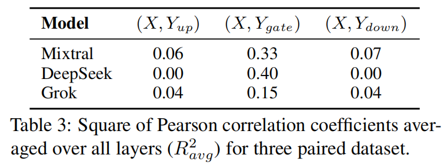

# A Closer Look into MoEs in LLMs

This repository contains the code of [A Closer Look into Mixture-of-Experts in Large Language Models](https://arxiv.org/abs/2406.18219).

## Overview :eyes:

We make an initial attempt to understand the inner workings of MoE-based large language models. 
Concretely, we comprehensively study the parametric and behavioral features of three recent MoE-based models ([Mixtral 8x7B](https://arxiv.org/pdf/2401.04088), [DeepSeekMoE](https://arxiv.org/pdf/2401.06066), [Grok-1](https://github.com/xai-org/grok-1)) and reveal some intriguing observations, including:

- **Neurons act like fine-grained experts.** \
    Intuitively, the gate embedding determines the expert selection while the gate projection matrix of expert is responsible for choosing neurons to activate. Interestingly, their similarity values show association as described in the table below (X and Y denotes the similarity values of the gate embedding and the three projection matrices, respectively).
    Therefore, they may learn similar knowledge to perform the choosing operation reasonably, in the other words, the expert neurons are fine-grained experts.

    

- **The router of MoE usually selects experts with larger output norms.** \
    Using Mixtral as an example here, we find that the expert that outputs feature vector with the *i*-th largest norm is the most likely to be assigned with the *i*-th highest score by the gate. 
    (In the figure, larger ranking index means larger norm/score, so rank 8 is the largest.)

    

- **The expert diversity increases as the layer increases, while the last layer is an outlier.** \
    In several experiments, we observe that the similarities between experts are generally lower in deep layers, whereas the similarities increase in the last layer(s). 
    For instance, the figure below shows the similarity heat maps of the Mixtral experts' outputs of different layers, where the comparison of the values is: Layer 31 > Layer 6 > Layer 27.

    

Based on the observations, we also provide suggestions for a broad spectrum of MoE practitioners, such as router design and expert allocation. 
**Check out our paper for more inspiring observations and suggestions!**

## Setup :wrench:

1. Download the model checkpoints \
    By default, our code loads the pre-downloaded models from the `ckpt` directory. 
    You can also modify it to directly download from HuggingFace. The download links of the models we used are listed below:
    - [Mixtral 8x7B Base](https://huggingface.co/mistralai/Mixtral-8x7B-v0.1)
    - [Mixtral 8x7B Instruct](https://huggingface.co/mistralai/Mixtral-8x7B-Instruct-v0.1)
    - [Mistral](https://huggingface.co/mistralai/Mistral-7B-v0.1)
    - [DeepSeekMoE](https://huggingface.co/deepseek-ai/deepseek-moe-16b-base)
    - [Grok-1](https://huggingface.co/hpcai-tech/grok-1)

2. Create the conda environment
    ```bash
    git clone https://github.com/kamanphoebe/Look-into-MoEs.git
    cd Look-into-MoEs
    conda create -n analyze --file env.txt
    ```
    After creating the conda enviroment, you have to select it as the Jupyter kernel.

## Usage :memo:

The two Jupyter notebooks `static_analysis.ipynb` and `dynamic_analysis.ipynb` contains the code of experiments about the static parameters and dynamic behaviours, respectively.
You can simply run the corresponding code blocks for each experiment, which is titled the same as in the paper. 
Note that some experiments employ part of the [Wikitext 103 test set](https://huggingface.co/datasets/Salesforce/wikitext), which we have already provided in the `wikitext103_text.csv`.

## Citation :star2:

Please cite our work if you find it useful!
```
@article{lo2024closer,
  title={A Closer Look into Mixture-of-Experts in Large Language Models},
  author={Lo, Ka Man and Huang, Zeyu and Qiu, Zihan and Wang, Zili and Fu, Jie},
  journal={arXiv preprint arXiv:2406.18219},
  year={2024}
}
```

## Acknowledgement :tada:

Our configuration and modeling files of the models are modified based on the corresponding HuggingFace repositories as listed in the [Setup](https://github.com/kamanphoebe/Look-into-MoEs/tree/main?tab=readme-ov-file#setup-wrench) section. 
Thanks for the authors' great work!